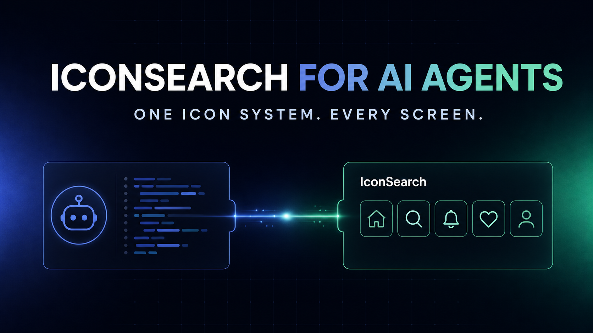
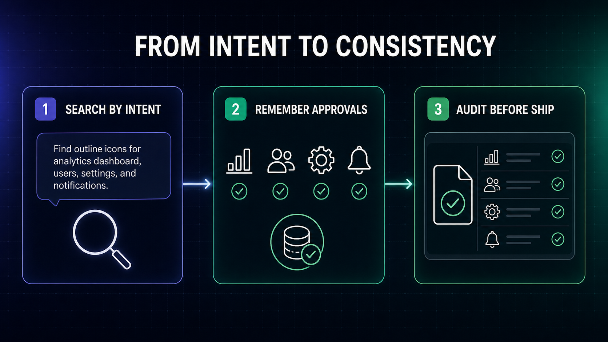
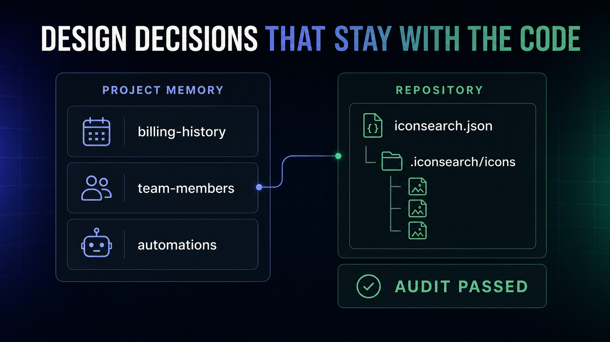

# AI Coding Agents Can Build the Interface. Now They Can Use a Real Icon System.

*Introducing IconSearch for AI agents: intent-based icon search, project memory, exact SVG retrieval, and visual consistency audits across 355,702 icons.*



*IconSearch gives coding agents a direct path from interface intent to a consistent, approved icon system.*

AI coding agents can now create a working settings screen, dashboard, or onboarding flow in minutes. But there is a difference between an interface that works and one that feels designed.

Icons are a surprisingly common place for that difference to show.

An agent might use a thin outline icon for one navigation item, a filled icon for the next, and an icon from an entirely different library on another screen. It may choose a symbol that is technically related to the feature but wrong for the product’s visual language. Even when a human corrects the choice, that decision is often forgotten the next time the agent generates a screen.

This is the problem we built **IconSearch for AI agents** to solve.

## The problem was not another search box

IconSearch already brings together **355,702 icons across 229 open-source collections**. Designers and developers can search the catalogue, compare libraries, inspect licences, and copy the output they need without keeping ten different icon-library tabs open.

Across our integration platforms, IconSearch has now reached roughly **200 users**.

But AI agents introduced a different challenge. An agent does not need another webpage to visit. It needs a reliable way to:

- understand the icon system already used by a project;
- search by interface intent instead of guessing an export name;
- retrieve the exact approved SVG and its licence information;
- remember the choice for future screens; and
- audit the repository before the product ships.

That requires a workflow, not just a search result.

## A simple connection between the agent and IconSearch

IconSearch connects to coding agents through **MCP**, or Model Context Protocol.

The name sounds technical, but the idea is straightforward: MCP gives an AI agent a controlled set of external tools. Think of it as plugging a specialised tool belt into the agent. After the one-time setup, the agent can ask IconSearch to search, retrieve, save, and audit icons when the task requires it.

The user stays in control. The agent does not receive unlimited access to the computer or the IconSearch account. It receives a small set of clearly defined icon operations.



*The workflow moves from natural-language intent to approved project memory and a final consistency audit.*

## From intent to a production-ready icon

Imagine asking a coding agent:

> Build the settings navigation using a consistent set of outline icons for profile, billing, notifications, security, and integrations.

Without IconSearch, the agent may guess five icon names, mix libraries, or install a new package that the project does not need.

With IconSearch connected, the workflow changes.

### 1. Read the project first

The agent checks whether the repository already has an icon system. It reads the preferred library, default size, colour behaviour, stroke width, and any approved semantic assignments.

If `billing-history` already maps to a Lucide receipt icon, the agent can reuse that decision instead of inventing a new one.

### 2. Search by meaning

The agent searches for concepts such as “billing history”, “automated reconciliation”, or “quiet empty state”. It does not need to know that a particular package calls the icon `receipt-text`, `history`, or something else.

This is important because product teams think in interface meaning, while icon libraries expose package-specific names.

### 3. Retrieve the exact asset

Once a candidate is selected, IconSearch returns the exact sanitised SVG together with its original library, source page, author, and licence metadata.

The agent is no longer copying an approximate symbol from memory. It is working with a specific, reviewable asset.

### 4. Save the approved decision

When the user approves the icon, the agent can save it under a semantic name such as `billing-history` rather than a visual name such as `receipt-2`.

The SVG is stored under `.iconsearch/icons`, and the decision is added to `iconsearch.json`.

### 5. Audit before shipping

Before the interface is released, IconSearch can inspect the repository for missing managed files, changed checksums, unmanaged SVGs, inline SVG usage, empty project memory, and mixed icon packages.

The audit does not replace human review. It gives the reviewer a focused list of visual-system risks to check.

## Design decisions that live with the code

The most important part of this workflow is project memory.



*Approved semantic icon assignments remain readable, reviewable, and portable inside the repository.*

The first approved save creates an `iconsearch.json` manifest and a managed `.iconsearch/icons` directory. A simplified entry looks like this:

```json
{
  "version": 1,
  "style": {
    "preferredLibraries": ["lucide"],
    "defaultSize": 20,
    "color": "currentColor",
    "strokeWidth": 2
  },
  "icons": {
    "billing-history": {
      "library": "lucide",
      "name": "receipt-text",
      "path": ".iconsearch/icons/billing-history.svg"
    }
  }
}
```

This file is deliberately ordinary. A designer can understand it. A developer can review it in a pull request. An agent can follow it. A continuous-integration check can audit it.

The project no longer depends on one person remembering which icon was chosen three months ago.

## Built with clear security boundaries

Giving an agent a new tool should not mean giving it uncontrolled access.

IconSearch uses revocable API keys for authenticated search and retrieval. The secret is supplied to the local MCP process and is never written to the project manifest. Keys can be revoked from the account page and expire after 90 days.

Repository changes are also intentionally narrow. The save operation writes only `iconsearch.json` and SVG files inside `.iconsearch/icons`, beneath a validated project root. The server rejects symlink traversal, unsafe paths, and active or external content in SVG files.

Humans should still review every agent-generated change before committing or deploying it. The goal is not to remove judgement. It is to give judgement better inputs and a memory.

## Getting started with Codex

The current integration works with Codex and other MCP-compatible coding agents. For Codex, the basic setup is:

1. Install Node.js 20 or newer.
2. Sign in to IconSearch and generate an API key.
3. Run the one-time setup command in PowerShell or Terminal:

```bash
codex mcp add iconsearch --env ICONSEARCH_TOKEN=YOUR_API_KEY -- npx -y @iconsearch/mcp-server
```

4. Restart Codex and confirm that IconSearch appears under `/mcp`.
5. Start with a read-only request:

> Use IconSearch to find five icons for settings navigation. Do not change any files.

If the `codex` command is not available in the terminal, the same connection can be added manually through the global `~/.codex/config.toml` file. The complete Windows, macOS, and Linux instructions are available in the setup guide.

## Why this matters for AI-generated interfaces

The next stage of AI-assisted product development is not only about generating more code. It is about preserving the decisions that make a product coherent.

Typography, spacing, colour, motion, and iconography all need systems. When an AI agent can read those systems before acting, reuse approved decisions, and surface inconsistencies before shipping, generated interfaces begin to feel less random and more intentional.

IconSearch is our contribution to that direction: a focused visual tool that helps an agent stop guessing and start following an icon system.

**Explore IconSearch for AI agents:** https://iconsearch.info/agents

**Read the complete setup guide:** https://iconsearch.info/docs/agents

---

**Suggested Medium topics:** Artificial Intelligence, Design Systems, UI/UX, Web Development, Developer Tools

