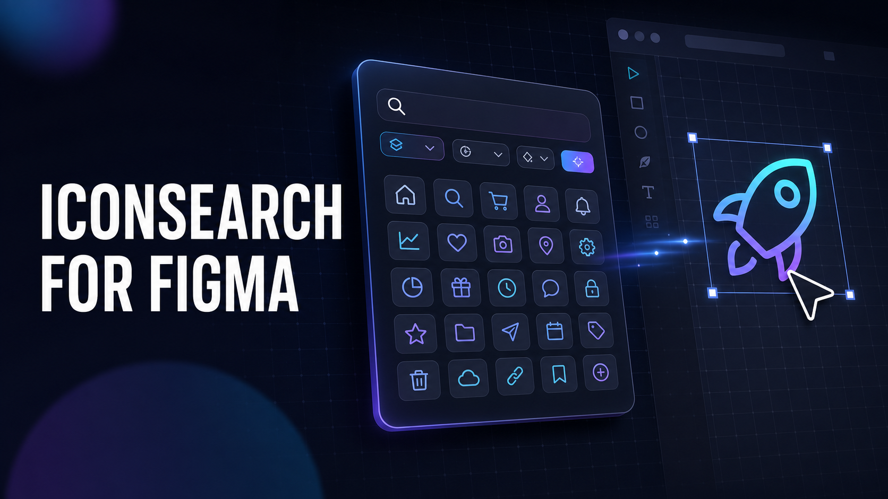

# The Fastest Route from “I Need an Icon” to an Editable Figma Layer

## How IconSearch reduces tab-hopping, keeps visual exploration moving, and helps design and development speak the same language

[IconSearch for Figma](https://iconsearch.info/figma-plugin) brings [IconSearch’s open-source SVG catalog](https://iconsearch.info/icon-search) directly onto the design canvas. Instead of leaving Figma, opening browser tabs, downloading files, and cleaning imports, designers can find, compare, customize, save, drag, and insert production-ready vector icons inside the tool where the work already happens.

Finding one icon sounds like a tiny task. In practice, it often becomes a chain of interruptions: open a new tab, search several libraries, compare styles, download an SVG, return to Figma, import it, resize it, recolor it, and repeat. None of those steps is especially difficult. Together, they break concentration and quietly slow down design work.

We built IconSearch for Figma to shorten that chain.

## What is IconSearch for Figma?

IconSearch for Figma is a focused icon browser that runs inside Figma. It connects the canvas to the same large catalog available through the IconSearch website, with more than 355,000 searchable SVG icons at the time of writing. The catalog brings together well-known open-source libraries and hundreds of collections, so a designer can explore alternatives without visiting each library separately.

The plugin is deliberately simple. Search by a name or keyword, narrow the results by library or visual style, select an icon, choose its size and color, and place it on the active canvas. Icons arrive as editable vector layers rather than flattened screenshots, so they remain useful for real interface work.

You can also drag an icon from the results to the position where it belongs or save a frequent choice for later. These small details matter when icons are not a one-off task but a repeated part of navigation, dashboards, mobile interfaces, presentations, and design systems.

## What the plugin actually helps you do

### 1. Search without leaving the canvas

The most immediate benefit is continuity. You can search for terms such as “home,” “arrow,” “chart,” “menu,” “lock,” or “notification” while the layout remains visible behind the plugin. That context helps you judge an icon against the interface it must serve instead of evaluating it in an isolated browser gallery.

Search is useful for known targets, but it also supports exploration. A concept such as “security” may lead to locks, shields, keys, fingerprints, or verified badges. Seeing those options together makes it easier to choose the metaphor that best fits the product.

### 2. Compare libraries and styles in one place

Two icons can describe the same action and still feel completely different. One may be rounded and friendly; another may be geometric and technical. Stroke weight, corner treatment, optical size, and fill style all influence whether an icon belongs in a particular interface.

IconSearch lets you filter by library and by styles such as outline, solid, duotone, two tone, or sharp. That makes broad exploration faster and gives disciplined teams a way to stay within an approved family once they have chosen one. If you are still deciding on a family, the [IconSearch comparison guides](https://iconsearch.info/compare) provide a deeper view outside the plugin.

### 3. Set a useful size and color before insertion

The plugin includes common size presets and a color control. That means the icon can enter the file closer to its intended state, whether it is a 16-pixel utility symbol, a 24-pixel navigation icon, or a larger illustration element.

This is not a replacement for Figma variables, component properties, or a mature token system. It is a faster starting point. A team can insert the right vector, then connect it to the same color and sizing rules used throughout the rest of the product.

### 4. Insert clean, editable SVG vectors

An icon is only useful in a design file if it remains workable. IconSearch inserts SVG artwork as a Figma vector node, scales it proportionally, names the layer, and places it on the current page. The result can be resized, recolored, grouped, turned into a component, or incorporated into a larger pattern.

For quick composition, the Insert action places the selected icon near the viewport center. For more intentional placement, drag and drop can put it directly on the relevant card, button, or frame.

### 5. Save the icons you use repeatedly

Most products rely on a small working vocabulary: close, chevron, search, settings, user, alert, check, and a handful of domain-specific symbols. Saving those icons creates a practical shortlist inside the plugin, reducing repeat searches and helping frequent choices stay consistent.

### 6. Create a clearer bridge between design and code

One of the costliest handoff problems is not the SVG itself; it is ambiguity. A designer may choose an icon visually, while a developer later tries to find the nearest match in a package. Small differences appear, names drift, and the implemented screen no longer quite matches the design.

IconSearch uses the same source across its web experience, Figma plugin, and [VS Code extension](https://iconsearch.info/vscode-extension). When design and development refer to the same library and icon name, the conversation becomes concrete: “use `home` from Lucide” is more actionable than “use the little house from the mockup.”

## Who benefits most?

**Product and UI designers** can test several visual directions quickly without interrupting layout work. This is especially useful during wireframing and early exploration, when the right metaphor matters more than polishing a single asset.

**Design-system teams** can compare libraries, establish an approved family, and save common choices. The catalog offers breadth; the team’s rules provide consistency.

**Startups and small teams** gain access to a broad set of ready-made vectors without maintaining a custom icon pipeline on day one. That frees limited design time for flows, content, hierarchy, and customer problems.

**Developers who work in Figma** can find recognizable assets for prototypes and communicate the exact source back to code. The shared naming also reduces guesswork during implementation.

**Students and new designers** can study how different icon families express the same idea. Comparing outline, solid, rounded, and sharp interpretations is a useful lesson in visual language—not just a convenient download workflow.

## A practical example: building a dashboard header

Imagine you are designing a dashboard header with search, notifications, help, and an account menu.

Without an integrated workflow, four icons can mean four searches, several downloads, and repeated imports. With IconSearch, you can search each concept in the plugin, lock the results to one library, keep the style on outline, set a common size and color, and insert each choice into the header.

The speed improvement is useful, but consistency is the bigger win. Because every result comes from the same chosen family, the icons are more likely to share proportions, stroke behavior, and visual tone. Save the final four and the same set is ready when you design the mobile header or settings screen.

## Where IconSearch can make the biggest difference

- **Navigation and toolbars:** quickly compare familiar actions while preserving a coherent icon family.

- **Dashboards and data products:** find charts, status symbols, filters, exports, and operational metaphors without assembling them from unrelated websites.

- **Rapid prototypes:** move from placeholder boxes to recognizable interface cues without turning asset hunting into the main task.

- **Design-system audits:** compare the icons already in a product with a candidate source library and identify inconsistent outliers.

- **Developer handoff:** document the source library and icon name so implementation begins with an exact reference.

- **Presentations and diagrams:** use editable vectors for flows, feature maps, and lightweight product storytelling.

## The important limits to understand

A large catalog creates choice, not automatic consistency. If every screen uses a different library, the product can feel uneven even when each icon looks good on its own. Choose a primary library, define acceptable weights and sizes, and treat exceptions as conscious decisions.

Open source also does not mean “no conditions.” Different libraries use different licenses, and some require attribution or impose other terms. Check the source library before shipping an icon commercially. The [IconSearch license guide](https://iconsearch.info/licenses) is a useful starting point, but your team remains responsible for following the license attached to each asset.

Finally, search works best with intent. Try concrete objects (“calendar,” “wallet,” “truck”), actions (“upload,” “share,” “refresh”), and outcomes (“success,” “warning,” “verified”). If the first term is too literal, search for the meaning you want the user to understand.

## A better icon workflow in four steps

1. Open the [IconSearch Figma Community listing](https://www.figma.com/community/plugin/1652731113142368438/iconsearch-free-svg-icons) and run the plugin in your design file.

2. Connect your IconSearch account, then search by object, action, or concept.

3. Filter by library and style, preview the candidates, and choose an appropriate size and color.

4. Insert or drag the SVG onto the canvas, then apply your design-system tokens and component conventions.

The goal is not to make icon choice thoughtless. It is to remove the mechanical work around that choice. Designers still decide which symbol communicates best, which family fits the product, and how it should behave in context. IconSearch simply makes those decisions faster to explore and easier to carry into production.

If your team is ready to spend less time hunting for assets and more time refining the product, explore [IconSearch](https://iconsearch.info/icon-search), then [install IconSearch for Figma](https://www.figma.com/community/plugin/1652731113142368438/iconsearch-free-svg-icons). The next icon you need can move from an idea to an editable canvas layer in seconds—not another browser detour.
